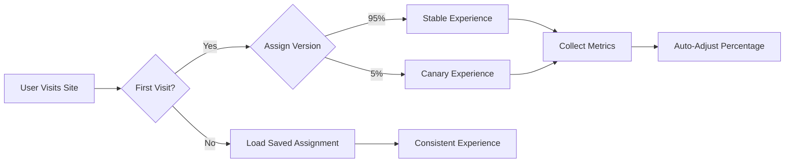

# Client-Side Canary Deployment

## Overview

This project demonstrates how to implement canary deployments for static web applications primarily on the client side. It enables gradual feature rollouts to a subset of users without requiring specialized server-side infrastructure such as global accelerators, load balancers, or service meshes. Traffic-shaping decisions—such as whether a user sees the new or old version—are made directly in the user's browser using JavaScript, potentially based on client-side cookies, local storage, randomized flags, or remotely-fetched values via API endpoints. Analytics are collected to inform rollout progression or trigger rollbacks.

## How It Works

1. Assigns users to either stable or canary groups based on configurable percentages
2. Tracks errors, performance, and user engagement
3. Gradually increases canary percentage when metrics look good
4. Rolls back features if error rates increase
5. Persists user assignments in localStorage



 ## Client-Side vs. Server-Side Canary Deployments
 
 ### What is a Client-Side Canary Deployment?
 
 In this approach, the traffic shaping decision (which version a user receives) happens mostly in the user's browser:
 
 - **No specialized server infrastructure required**: No need for global accelerators, load balancers, or service meshes
 - **Works with static hosting**: Compatible with GitHub Pages, Netlify, Vercel, or any static hosting
 - **JavaScript-based assignment**: Uses browser's localStorage (not server-side sessions) and JavaScript for user assignment
 - **Analytics-driven**: Collects metrics to evaluate canary performance vs. stable version
 
### How It Differs From Server-Side Canary Deployment

```mermaid
graph TD
    subgraph "Server-Side Canary Deployment"
        A[User Request] --> GA[Global Accelerator]
        GA --> SSDL{Server-Side Decision Logic at Edge}
        SSDL -->|95% of users| StablePath[Route to Stable]
        SSDL -->|5% of users| CanaryPath[Route to Canary]

        subgraph "Stable Traffic Flow"
            StablePath --> RLB1[Regional Load Balancer - Stable]
            RLB1 --> SM1[Service Mesh - Stable]
            SM1 --> EP1[Envoy Proxy / Linkerd2-proxy - Stable]
            EP1 --> C[Stable Version Server]
            C --> E[Response with Stable Version]
        end

        subgraph "Canary Traffic Flow"
            CanaryPath --> RLB2[Regional Load Balancer - Canary]
            RLB2 --> SM2[Service Mesh - Canary]
            SM2 --> EP2[Envoy Proxy / Linkerd2-proxy - Canary]
            EP2 --> D[Canary Version Server]
            D --> F[Response with Canary Version]
        end
    end

    subgraph "Client-Side Canary Deployment"
        G[User Request] --> H[Static Web Server or CDN]
        H --> I[index.html with JavaScript]
        I --> J{Client-Side Decision Logic}
        J -->|95% of users| K[Load Stable Version Assets]
        J -->|5% of users| L[Load Canary Version Assets]
    end

    %% Styles for key components
    style GA fill:#fdd,stroke:#333
    style SSDL fill:#af9,stroke:#333
    style EP1 fill:#cff,stroke:#333
    style EP2 fill:#ccf,stroke:#333
    style J fill:#af9,stroke:#333
```



## PostHog Analytics Integration

This project uses PostHog for analytics tracking in canary deployments. The system automatically:

- Tracks pageviews and events for stable and canary versions
- Reports errors and interactions
- Manages feature flag state

### GitHub Actions Integration

Our GitHub Actions workflows interact with PostHog in several ways:

1. **Deployment**: The workflow injects PostHog API keys from GitHub secrets
2. **Analytics Reporting**: A scheduled workflow fetches analytics data to monitor canary performance
3. **Automated Rollbacks**: If error rates in the canary version exceed thresholds, an automated rollback can be triggered

### Setup Requirements

To set up PostHog integration:

1. Create a PostHog account and project
2. Add the following secrets to your GitHub repository:
   - `POSTHOG_API_KEY`: Your PostHog API key for server-side operations
   - `POSTHOG_PUBLIC_KEY`: Your PostHog public key for client-side tracking
   - `POSTHOG_PROJECT_ID`: Your PostHog project ID

## Installation

Add the following script tags to your HTML:

```html
<!-- Core canary functionality -->
<script src="https://cdn.example.com/canary.js"></script>

<!-- Optional: Version switcher UI component -->
<script src="https://cdn.example.com/version-switcher.js"></script>

<!-- Optional: PostHog analytics integration -->
<script src="https://cdn.example.com/analytics.js"></script>

<!-- Initialize canary -->
<script>
  canary.init();
</script>
```

## Components

This library consists of two main components:

1. **Core Canary System** (`src/canary.js`): Handles feature flagging, metrics tracking, and version assignments
2. **Version Switcher** (`src/components/version-switcher.js`): Optional UI component that allows users to manually switch between versions

### Using the Version Switcher

```html
<!-- First include the main canary library -->
<script src="src/canary.js"></script>

<!-- Then include the version switcher -->
<script src="src/components/version-switcher.js"></script>

<!-- Initialize both components -->
<script>
  // Initialize canary first
  canary.init({
    initialCanaryPercentage: 5
  });
  
  // Then initialize the switcher
  new VersionSwitcher();
</script>
```

## Usage

### Basic Feature Flags

```html
<!-- Check if a feature should be enabled for this user -->
<script>
  if (canary.isEnabled('newDesign')) {
    // Show the new design
    document.body.classList.add('new-design');
  }
</script>
```

### Define Multiple Features

```html
<script>
  // Features defined with sensible defaults (5% of users initially)
  const features = {
    'newHeader': { description: 'Updated navigation header' },
    'betaCheckout': { description: 'Streamlined checkout process', initialPercentage: 2 }
  };
  
  canary.defineFeatures(features);
</script>
```

## Enhanced Analytics (Optional)

Add PostHog analytics with one extra line:

```html
<!-- Make sure analytics.js is loaded -->
<script src="https://cdn.example.com/analytics.js"></script>
<script>
  canary.analytics('phc_YOUR_KEY_HERE');
</script>
```

## Configuration (Optional)

```html
<script>
  // All configuration is optional with sensible defaults
  canary.config({
    initialCanaryPercentage: 5, // Start with 5% of users
    maxCanaryPercentage: 50,    // Never go above 50% without manual review
    safetyThreshold: 2,         // Keep at least 2% even on rollback
    storageKey: 'my_app_canary' // Custom storage key
  });
</script>
```

## Viewing Results

Results are automatically collected and stored in-memory or in localStorage (depending on setup).

View them anytime:

```html
<button onclick="console.table(canary.getResults())">Show Canary Results</button>
```

## Workflows

The project includes a comprehensive GitHub Actions workflow that automates all canary deployment processes:

### Canary Deployment & Analytics Workflow

The single consolidated workflow (`deploy-gh-pages.yml`) handles all aspects of canary deployment:

- **Deployment**: Triggered by pushes to main branch
  - Builds the project with npm/Rollup
  - Injects PostHog API keys from GitHub secrets
  - Deploys to GitHub Pages

- **Analytics**: Runs every 6 hours by default
  - Uses `analyze-canary.js` to query PostHog data
  - Compares error rates between stable and canary versions
  - Creates detailed reports in GitHub Actions summaries
  - Implements automatic rollback if error thresholds are exceeded

- **Manual Operations**: Can be manually triggered for:
  - `deploy`: Deploy the latest code to GitHub Pages
  - `analyze`: Run analytics to evaluate canary performance
  - `adjust-canary`: Update the canary percentage for traffic allocation

For detailed information on the workflow and supporting scripts, see [docs/WORKFLOWS.md](./docs/WORKFLOWS.md).

For more details on the analytics integration, see [docs/ANALYTICS.md](./docs/ANALYTICS.md).

## Want More Control?

The one-line approach works for most cases, but you can view advanced options in [docs/ADVANCED.md](docs/ADVANCED.md).
