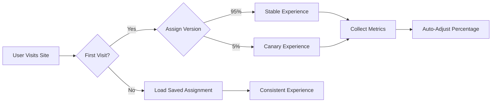

# Client-Side Canary Deployment

## Installation

### Option 1: One-line installation (recommended)

```html
<script src="https://cdn.jsdelivr.net/gh/yourusername/client-side-canary-deployment@main/dist/canary.js"></script>
```

### Option 2: Separate components

Load the core system:
```html
<script src="https://cdn.jsdelivr.net/gh/yourusername/client-side-canary-deployment@main/src/canary.js"></script>
```

Optionally, add the version switcher UI:
```html
<script src="https://cdn.jsdelivr.net/gh/yourusername/client-side-canary-deployment@main/js/version-switcher.js"></script>
```

## Components

This library consists of two main components:

1. **Core Canary System** (`src/canary.js`): Handles feature flagging, metrics tracking, and version assignments
2. **Version Switcher** (`src/components/version-switcher.js`): Optional UI component that allows users to manually switch between versions

### Using the Version Switcher

```html
<!-- First include the main canary library -->
<script src="src/canary.js"></script>

<!-- Then include the version switcher -->
<script src="src/components/version-switcher.js"></script>

<!-- Initialize both components -->
<script>
  // Initialize canary first
  canary.init({
    initialCanaryPercentage: 10
  });
  
  // Then initialize the switcher
  new VersionSwitcher();
</script>
```

## Usage

### Basic Feature Flags

```html
<!-- Check if a feature should be enabled for this user -->
<script>
  if (canary.isEnabled('newDesign')) {
    // Show the new design
    document.body.classList.add('new-design');
  }
</script>
```

### Define Multiple Features

```html
<script>
  // Features defined with sensible defaults (5% of users initially)
  const features = {
    'newHeader': { description: 'Updated navigation header' },
    'betaCheckout': { description: 'Streamlined checkout process', initialPercentage: 2 }
  };
  
  canary.defineFeatures(features);
</script>
```

## How It Works

1. Assigns users to either stable or canary groups based on configurable percentages
2. Tracks errors, performance, and user engagement
3. Gradually increases canary percentage when metrics look good
4. Rolls back features if error rates increase
5. Persists user assignments in localStorage



## Enhanced Analytics (Optional)

Add PostHog analytics with one extra line:

```html
<script>
  canary.analytics('ph_YOUR_KEY_HERE');
</script>
```

## Configuration (Optional)

```html
<script>
  // All configuration is optional with sensible defaults
  canary.config({
    initialCanaryPercentage: 5, // Start with 5% of users
    maxCanaryPercentage: 50,    // Never go above 50% without manual review
    safetyThreshold: 2,         // Keep at least 2% even on rollback
    storageKey: 'my_app_canary' // Custom storage key
  });
</script>
```

## Viewing Results

Results are automatically collected and stored. View them anytime:

```html
<button onclick="console.table(canary.getResults())">Show Canary Results</button>
```

## Want More Control?

The one-line approach works for most cases, but you can [view advanced options](ADVANCED.md) if needed.
