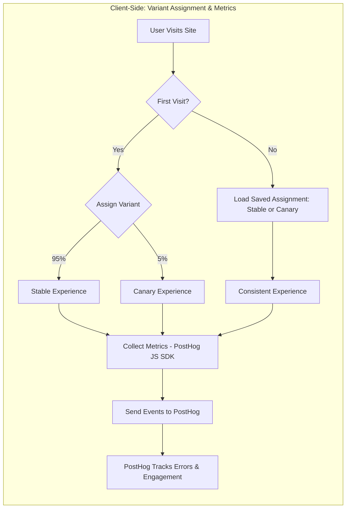
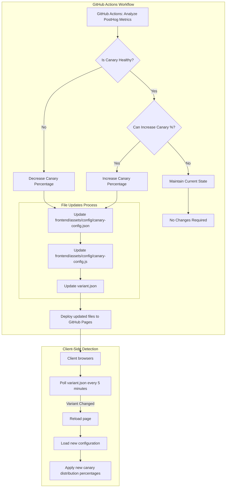

# Client-Side Canary Deployment

**enabling continuous delivery, gradual feature rollout, and real-time testing in production.**

## Overview

This project demonstrates how to implement canary deployments for static web applications. It enables gradual feature rollouts to a subset of users without requiring specialized server-side infrastructure such as global accelerators, load balancers, or service meshes. Traffic-shaping decisions—such as whether a user sees the new or old variant—are made directly in the user's browser using JavaScript, potentially based on client-side cookies, local storage, randomized flags, or remotely-fetched values via API endpoints. Analytics are collected to inform rollout progression or trigger rollbacks.

## How It Works

1. Assigns users to either stable or canary groups based on configurable percentages
2. Tracks errors, performance, and user engagement
3. Gradually increases canary percentage when metrics look good
4. Rolls back features if error rates increase
5. Persists user assignments in localStorage
6. Uses automatic variant detection to refresh clients when configuration changes

## Automatic Variant Detection & Client Refresh

The system ensures all clients stay up-to-date with the latest canary configurations:

1. **Server-Side Updates**:
   - Every deployment updates `variant.json` with an incremented version number
   - Configuration changes update `frontend/assets/config/canary-config.json`
   - All changes are deployed to GitHub Pages automatically

2. **Client-Side Detection**:
   - The `CanaryConfigManager` loads configuration from multiple sources with proper precedence
   - All pages poll for changes to `variant.json` every 5 minutes
   - When variant changes are detected, the page triggers a hard reload
   - Local variant information is stored in localStorage for comparison

This ensures that when canary distribution percentages are adjusted (either automatically or manually), all users receive the updated configuration without manual intervention.

## Client-Side vs. Server-Side Canary Deployments
 
### What is a Client-Side Canary Deployment?
 
In this approach, the traffic shaping decision (which variant a user receives) happens mostly in the user's browser:
 
- **No specialized server infrastructure required**: No need for global accelerators, load balancers, or service meshes
- **Works with static hosting**: Compatible with GitHub Pages
- **JavaScript-based assignment**: Uses browser's localStorage (not server-side sessions) and JavaScript for user assignment
- **Analytics-driven**: Collects metrics to evaluate stable vs. canary variants
 
### How It Differs From Server-Side Canary Deployment

```mermaid
graph TD
    subgraph "Server-Side Canary Deployment"
        A[User Request] --> GA[Global Accelerator and Domain Name Service]
        GA --> SSDL{Server-Side Decision Logic}
        SSDL -->|95% of users| StablePath[Route to Stable]
        SSDL -->|5% of users| CanaryPath[Route to Canary]

        subgraph "Stable Traffic Flow"
            StablePath --> RLB1[Regional Load Balancer - Stable]
            RLB1 --> SM1[Service Mesh - Stable]
            SM1 --> EP1[Envoy Proxy / Linkerd2-proxy - Stable]
            EP1 --> C[Stable Variant Server]
            C --> E[Response with Stable Variant]
            E --> PSA[PostHog Server SDK]
        end

        subgraph "Canary Traffic Flow"
            CanaryPath --> RLB2[Regional Load Balancer - Canary]
            RLB2 --> SM2[Service Mesh - Canary]
            SM2 --> EP2[Envoy Proxy / Linkerd2-proxy - Canary]
            EP2 --> D[Canary Variant Server]
            D --> F[Response with Canary Variant]
            F --> PSC[PostHog Server SDK]
        end
    end

    subgraph "Client-Side Canary Deployment"
        G[User Request] --> H[Static Web Server or CDN]
        H --> I[index.html with JavaScript]
        I --> J{Client-Side Decision Logic}
        J -->|95% of users| K[Load Stable Variant Assets]
        J -->|5% of users| L[Load Canary Variant Assets]

        K --> PHK[PostHog JS SDK - Stable]
        L --> PHL[PostHog JS SDK - Canary]
    end

    style PHK fill:#ffefc6,stroke:#333,stroke-width:1px
    style PHL fill:#ffe6cc,stroke:#333,stroke-width:1px
    style PSA fill:#ffefc6,stroke:#333,stroke-width:1px
    style PSC fill:#ffe6cc,stroke:#333,stroke-width:1px
    style J fill:#af9,stroke:#333
    style SSDL fill:#af9,stroke:#333
```

## PostHog Analytics Integration

This project uses PostHog for analytics tracking in canary deployments. The system automatically:

- Tracks pageviews and events for stable and canary variants
- Reports errors and interactions

### GitHub Actions Integration

Our GitHub Actions workflows interact with PostHog in several ways:

1. **Deployment**: The workflow injects PostHog API keys from GitHub secrets
2. **Analytics Reporting**: A scheduled workflow fetches analytics data to monitor canary performance
3. **Automated Rollbacks**: If error rates in the canary variant exceed thresholds, an automated rollback can be triggered

### Setup Requirements

To set up PostHog integration:

1. Create a PostHog account and project
2. Add the following secrets to your GitHub repository:
   - `POSTHOG_API_KEY`: Your PostHog API key for server-side operations
   - `POSTHOG_PUBLIC_KEY`: Your PostHog public key for client-side tracking
   - `POSTHOG_PROJECT_ID`: Your PostHog project ID

## Workflows

The project includes a comprehensive GitHub Actions workflow that automates all canary deployment processes:

### Canary Deployment & Analytics Workflow

The single consolidated workflow (`deploy-gh-pages.yml`) handles all aspects of canary deployment:

- **Deployment**: Triggered by pushes to main branch
  - Injects PostHog API keys from GitHub secrets
  - Deploys to GitHub Pages

- **Analytics**: Runs every 6 hours by default
  - Uses `.github/scripts/canary-analyzer.js` to query PostHog data
  - Compares error rates between stable and canary variants
  - Creates detailed reports in GitHub Actions summaries
  - Implements automatic rollback if error thresholds are exceeded

- **Manual Operations**: Can be manually triggered for:
  - `deploy`: Deploy the latest code to GitHub Pages
  - `analyze`: Run analytics to evaluate canary performance
  - `adjust-canary`: Update the canary percentage for traffic allocation

## Comparisons with Other Tools/Services

While this project facilitates client-side JavaScript-driven canary deployments via GitHub Actions, other Orchestration, CI/CD and GitOps tools can support or offer alternative (often server-side) canary strategies. The following documents explore how various tools and services can be used:

*   **Orchestration:**
    *   [Amazon Elastic Container Service (ECS)](./docs/comparisons/amazon-ecs/README.md)
    *   [Amazon Elastic Kubernetes Service (EKS)](./docs/comparisons/amazon-eks/README.md)
    *   [Google Kubernetes Engine (GKE)](./docs/comparisons/google-gke/README.md)
    *   [Azure Kubernetes Service (AKS)](./docs/comparisons/azure-aks/README.md)
*   **CI/CD & GitOps:**
    *   [AWS CodePipeline](./docs/comparisons/aws-codepipeline/README.md)
    *   [CircleCI](./docs/comparisons/circleci/README.md)
    *   [Argo CD](./docs/comparisons/argo-cd/README.md)
    *   [Argo Rollouts](./docs/comparisons/argo-rollouts/README.md)
    *   [Flux](./docs/comparisons/flux/README.md)
    *   [PipeCD](./docs/comparisons/pipecd/README.md)

These comparisons aim to clarify how each tool can contribute to a client-side canary setup or how their native canary functionalities differ.

## Documentation

- [README.md](./README.md) (this file)
- [docs/ADVANCED.md](./docs/ADVANCED.md)
- [docs/ANALYTICS.md](./docs/ANALYTICS.md)
- [docs/ART.md](./docs/ART.md)
- [docs/WORKFLOWS.md](./docs/WORKFLOWS.md)

## Demonstration: Static Web Application

- https://lloydchang.github.io/client-side-canary-deployment
