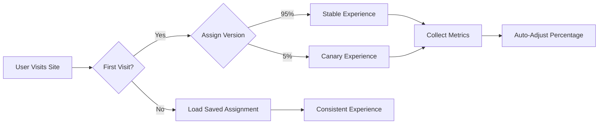

# Client-Side Canary Deployment

## Overview

This project demonstrates how to implement canary deployments for static web applications primarily on the client side. It enables gradual feature rollouts to a subset of users without requiring server-side infrastructure such as load balancers, service meshes, or global accelerators. Traffic-shaping decisions—such as whether a user sees the new or old version—are made directly in the user's browser using JavaScript, potentially based on client-side cookies, local storage, randomized flags, or remotely-fetched values via API endpoints. Analytics are collected to inform rollout progression or trigger rollbacks.

## How It Works

1. Assigns users to either stable or canary groups based on configurable percentages
2. Tracks errors, performance, and user engagement
3. Gradually increases canary percentage when metrics look good
4. Rolls back features if error rates increase
5. Persists user assignments in localStorage



 ## Client-Side vs. Server-Side Canary Deployments
 
 ### What is a Client-Side Canary Deployment?
 
 In this approach, the traffic shaping decision (which version a user receives) happens mostly in the user's browser:
 
 - **No server infrastructure required**: No need for global accelerators, load balancers, service meshes
 - **Works with static hosting**: Compatible with GitHub Pages, Netlify, Vercel, or any static hosting
 - **JavaScript-based assignment**: Uses browser's localStorage (not server-side sessions) and JavaScript for user assignment
 - **Analytics-driven**: Collects metrics to evaluate canary performance vs. stable version
 
### How It Differs From Traditional Server-Side Approaches

```mermaid
graph TD
    subgraph "Server-Side Canary Deployment"
        A[User Request] --> GA[Global Accelerator]
        GA --> RLB[Regional Load Balancer]
        RLB --> SM[Service Mesh - e.g. Istio or Linkerd]
        
        SM -->|95% of traffic| EP1[Envoy Proxy or Linkerd2-proxy to Stable]
        SM -->|5% of traffic| EP2[Envoy Proxy or Linkerd2-proxy to Canary]

        EP1 --> C[Stable Version Server]
        EP2 --> D[Canary Version Server]

        C --> E[Response with Stable Version]
        D --> F[Response with Canary Version]
    end

    subgraph "Client-Side Canary Deployment"
        G[User Request] --> H[Static Web Server or CDN]
        H --> I[index.html with JavaScript]
        I --> J{Client-Side Decision Logic}
        J -->|95% of users| K[Load Stable Version Assets]
        J -->|5% of users| L[Load Canary Version Assets]
    end

    style GA fill:#fdd,stroke:#333
    style LB fill:#f9a,stroke:#333
    style SM fill:#fcf,stroke:#333
    style EP1 fill:#cff,stroke:#333
    style EP2 fill:#ccf,stroke:#333
    style J fill:#af9,stroke:#333
```



## Installation

### Option 1: One-line installation (recommended)

```html
<script src="https://cdn.jsdelivr.net/gh/yourusername/client-side-canary-deployment@main/dist/canary.js"></script>
```

### Option 2: Separate components

Add the following script tags to your HTML:

```html
<!-- Core canary functionality -->
<script src="https://cdn.example.com/canary.js"></script>

<!-- Optional: PostHog analytics integration -->
<script src="https://cdn.example.com/analytics.js"></script>

<!-- Optional: Version switcher UI component -->
<script src="https://cdn.example.com/version-switcher.js"></script>

<!-- Initialize canary -->
<script>
  canary.init();
</script>
```

> **Important**: Make sure to load the scripts in the correct order as shown above.

## Components

This library consists of two main components:

1. **Core Canary System** (`src/canary.js`): Handles feature flagging, metrics tracking, and version assignments
2. **Version Switcher** (`src/components/version-switcher.js`): Optional UI component that allows users to manually switch between versions

### Using the Version Switcher

```html
<!-- First include the main canary library -->
<script src="src/canary.js"></script>

<!-- Then include the version switcher -->
<script src="src/components/version-switcher.js"></script>

<!-- Initialize both components -->
<script>
  // Initialize canary first
  canary.init({
    initialCanaryPercentage: 5
  });
  
  // Then initialize the switcher
  new VersionSwitcher();
</script>
```

## Usage

### Basic Feature Flags

```html
<!-- Check if a feature should be enabled for this user -->
<script>
  if (canary.isEnabled('newDesign')) {
    // Show the new design
    document.body.classList.add('new-design');
  }
</script>
```

### Define Multiple Features

```html
<script>
  // Features defined with sensible defaults (5% of users initially)
  const features = {
    'newHeader': { description: 'Updated navigation header' },
    'betaCheckout': { description: 'Streamlined checkout process', initialPercentage: 2 }
  };
  
  canary.defineFeatures(features);
</script>
```

## Enhanced Analytics (Optional)

Add PostHog analytics with one extra line:

```html
<!-- Make sure analytics.js is loaded -->
<script src="https://cdn.example.com/analytics.js"></script>
<script>
  canary.analytics('ph_YOUR_KEY_HERE');
</script>
```

## Configuration (Optional)

```html
<script>
  // All configuration is optional with sensible defaults
  canary.config({
    initialCanaryPercentage: 5, // Start with 5% of users
    maxCanaryPercentage: 50,    // Never go above 50% without manual review
    safetyThreshold: 2,         // Keep at least 2% even on rollback
    storageKey: 'my_app_canary' // Custom storage key
  });
</script>
```

## Viewing Results

Results are automatically collected and stored in-memory or in localStorage (depending on setup).

View them anytime:

```html
<button onclick="console.table(canary.getResults())">Show Canary Results</button>
```

## Want More Control?

The one-line approach works for most cases, but you can [view advanced options in ADVANCED.md](ADVANCED.md).
