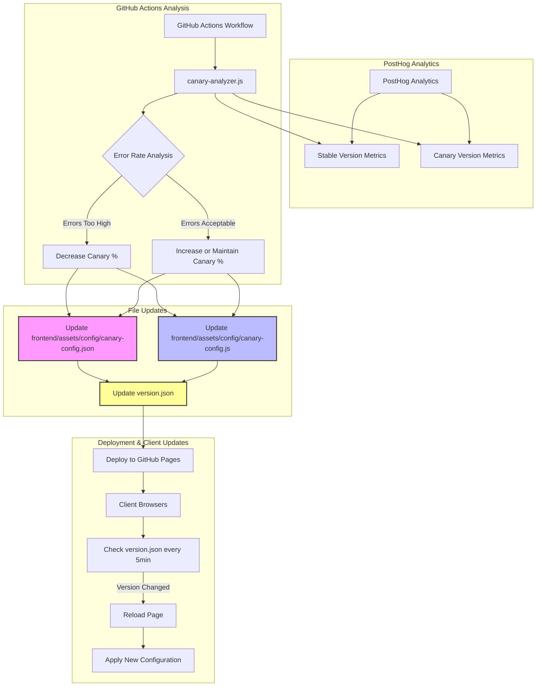
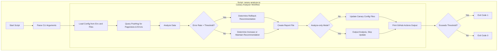

# PostHog Analytics Integration

This document explains how our client-side canary deployment system integrates with PostHog for analytics and how to use the GitHub Actions workflows to analyze deployment performance.

## How It Works

1. **Client-side tracking**: The `canary.js` and `analytics.js` scripts automatically track:
   - Pageviews with version information (stable/canary)
   - Error events with stack traces and context

2. **PostHog dashboard**: All events are sent to your PostHog instance where you can:
   - Build custom dashboards for monitoring
   - Create funnels to analyze user behavior differences
   - Set up alerts for anomalies

3. **GitHub Actions integration**: Automated workflows query the PostHog API to:
   - Monitor error rates between versions
   - Generate reports for stakeholders
   - Trigger automatic rollbacks if needed

## Analytics-Driven Configuration Updates

The system uses analytics data to make informed decisions about canary deployments:





The file update sequence:

1. **Analytics collection**: Client interactions tracked in PostHog
2. **Analysis**: `canary-analyzer.js` evaluates metrics and decides on percentage changes
3. **Configuration updates**:
   - `frontend/assets/config/canary-config.json`: Updates the canary percentage settings
   - `frontend/assets/config/canary-config.js`: Updates client-side JavaScript configuration
   - `version.json`: Increments version number to trigger client refreshes
4. **Deployment**: Files are pushed to GitHub Pages
5. **Client detection**: Pages detect version changes and reload

1. **Automatic Analysis**:
   - Every 6 hours, the GitHub Actions workflow queries PostHog data
   - Compares error rates between stable and canary versions
   - Makes decisions based on configurable thresholds

2. **Configuration Updates**:
   - Updates `frontend/assets/config/canary-config.json` and `frontend/assets/config/canary-config.js` with new percentages
   - Increments `version.json` to trigger client refreshes
   - Deploys changes to GitHub Pages automatically

3. **Client Propagation**:
   - All client pages periodically check for version updates every 5 minutes
   - When changes are detected, pages automatically reload
   - Users instantly receive updated canary assignments

This creates a fully automated feedback loop where:
- User interactions and errors are tracked in PostHog
- Analytics data drives canary percentage adjustments
- Changes are automatically propagated to all clients
- The system continuously optimizes the deployment

## Setup Instructions

### 1. PostHog Setup

1. Create an account at [PostHog](https://posthog.com)
2. Create a new project
3. Get your API credentials:
   - API Key (for server-side operations)
   - Project API Key (for client-side tracking)
   - Project ID

### 2. GitHub Secrets Configuration

Add the following secrets to your GitHub repository:

- `POSTHOG_API_KEY`: Your PostHog API key (private, server-side)
- `POSTHOG_PUBLIC_KEY`: Your PostHog project API key (public, client-side)
- `POSTHOG_PROJECT_ID`: Your PostHog project ID

### 3. Workflow Configuration

The project uses a GitHub Actions workflow to automate analytics collection and decision-making:

#### Primary Workflow (`.github/workflows/deploy-gh-pages.yml`)

This all-in-one workflow handles deployment, analytics, and canary adjustments with several configurable parameters:

- **Scheduled Analysis**: Runs every 6 hours by default to evaluate canary performance
- **Configuration Options**:
  - `ERROR_THRESHOLD`: Maximum acceptable error rate difference (default: 2%)
  - `TIMEFRAME`: Time period for analysis (default: 24h)

You can manually trigger specific tasks from the Actions tab:

- **deploy**: Deploy the latest code to GitHub Pages
- **analyze**: Run analytics to evaluate canary performance using `.github/scripts/analyze-canary.js`
- **adjust-canary**: Change the percentage of users directed to the canary version

#### Analysis Process

The analytics workflow:
1. Runs `analyze-canary.js` which queries PostHog for event data
2. Compares pageviews and errors between stable and canary versions
3. Calculates error rates and determines if thresholds are exceeded
4. Generates a recommendation (continue or rollback)
5. Creates detailed reports in the workflow summary
6. Can trigger automatic rollback for high error rates

#### Analysis Reports

The workflow generates detailed analysis reports that include:
- Pageview and error statistics for both stable and canary versions
- Calculated error rates and relative increases
- Recommended actions (continue or rollback)
- Automatic rollback process when thresholds are exceeded

These reports are available in the GitHub Actions run summary and are also stored as artifacts.

#### Adjusting Canary Percentage

To change the percentage of users who receive the canary version:

1. Go to the Actions tab in your GitHub repository
2. Select the "Canary Deployment & Analytics" workflow
3. Click "Run workflow"
4. Select "adjust-canary" from the task dropdown
5. Enter the desired percentage (0-100) in the "canary_percentage" field
6. Click "Run workflow"

This will update the configuration and deploy it to GitHub Pages.

## Analyzing Results

The canary analytics workflow:

1. Queries PostHog for pageview and error events
2. Compares error rates between stable and canary versions
3. Produces a summary report in the workflow run
4. Archives detailed JSON results as an artifact
5. Automatically triggers a rollback if thresholds are exceeded

## Custom Analytics

To add custom event tracking in your application:

```javascript
// Track a custom event
window.canary.trackEvent('button_clicked', {
  element: 'signup-button',
  page: '/homepage'
});
```
