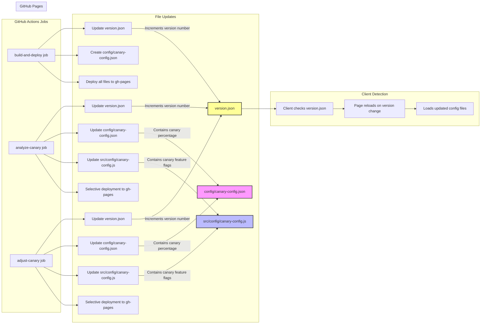
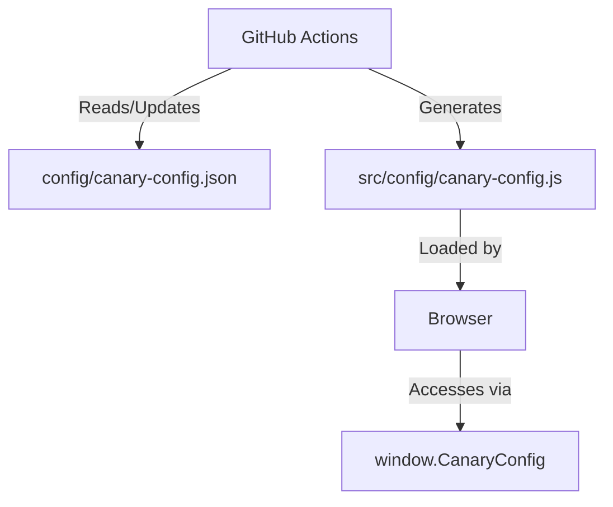

# GitHub Workflows & Scripts Documentation

This document provides detailed information about the GitHub Actions workflow and scripts used in this project for canary deployment automation.

## Workflow Overview

The project uses a single GitHub Actions workflow to manage all aspects of canary deployments:

| Workflow | File | Purpose |
|----------|------|---------|
| Canary Deployment & Analytics | `deploy-gh-pages.yml` | All-in-one workflow for deployment, analytics, and adjustments |

## Main Workflow: Canary Deployment & Analytics

This consolidated workflow (`deploy-gh-pages.yml`) handles all aspects of the canary deployment process.

### Triggers
- **Push to main branch**: Automatic deployment
- **Schedule**: Runs analytics every 6 hours
- **Manual trigger** with options:
  - `deploy`: Deploy latest code
  - `analyze`: Evaluate canary performance
  - `adjust-canary`: Change canary percentage

### Version Management & Client Updates

The workflow ensures that clients always get the latest configuration:

1. **Version File Updates**:
   - Each job runs `update-version.sh` which:
     - Reads current version from `version.json`
     - Increments the patch version (e.g., 1.0.3 → 1.0.4)
     - Updates the timestamp
   - This happens for all jobs: deployment, analysis, and adjustments

2. **Configuration Updates**:
   - The `canary-analyzer.js` script updates:
     - `config/canary-config.json`: Main JSON configuration 
     - `src/config/canary-config.js`: JavaScript configuration for client use

3. **Clean Deployment**:
   - For full deployments, all files are pushed to `gh-pages`
   - For config-only updates, selective deployment targets only:
     - `version.json`
     - `config/**`
     - `src/config/**`

4. **Client Detection**:
   - All HTML pages (index, stable, canary) check for version changes
   - Pages reload automatically when version changes are detected
   - 5-minute polling interval ensures timely updates

This creates a seamless update pipeline where configuration changes are automatically propagated to all clients.

### Jobs

#### 1. build-and-deploy
Handles the deployment of the application to GitHub Pages:
- Builds the project with Rollup
- Injects PostHog API keys from GitHub secrets
- Configures base path for GitHub Pages
- Deploys to the gh-pages branch

#### 2. analyze-canary
Analyzes canary performance using PostHog data:
- Runs the analysis script (`analyze-canary.js`)
- Creates a summary report with error rates and recommendations
- Saves detailed results as artifacts
- Can trigger automatic rollback if thresholds are exceeded
- Automatically adjusts canary percentage based on analysis results

#### 3. adjust-canary
Provides manual control over canary percentages:
- Allows immediate adjustment of canary traffic percentage via workflow dispatch
- Serves as a critical override for the automated system
- Updates the canary configuration with the specified percentage
- Deploys only the updated configuration to GitHub Pages
- Creates a summary report confirming the change

**Why manual control alongside automation?**
While the system includes automated analysis and adjustment through the `analyze-canary` job, the manual job serves several important purposes:
- **Emergency control**: Quickly respond to issues by adjusting or rolling back canary percentages
- **Special scenarios**: Handle business requirements that automated metrics can't account for
- **Testing & validation**: Set specific percentages during development or QA processes
- **Fine-grained control**: Allow product managers to directly influence rollout pace
- **Safety mechanism**: Provide a "break glass in case of emergency" option when automation isn't sufficient

This hybrid approach combining automated analysis with manual override capabilities is considered a best practice in progressive deployment systems.

## Supporting Scripts

### `analyze-canary.js`

This script queries the PostHog API to compare stable and canary version performance:

- Fetches pageviews and error events for both versions
- Calculates error rates and relative increases
- Determines if thresholds are exceeded
- Returns a recommendation (continue or rollback)

**Configuration options:**
- `POSTHOG_API_KEY`: API key for server-side operations
- `POSTHOG_PROJECT_ID`: PostHog project ID
- `POSTHOG_HOST`: PostHog host (default: app.posthog.com)
- `ERROR_THRESHOLD`: Maximum acceptable error rate increase (default: 0.02)
- `TIMEFRAME`: Analysis time period (default: 24h)

### `update-canary.js`

Script for updating the canary percentage configuration:

- Reads existing configuration or creates default
- Updates the canary percentage
- Writes updated configuration back to file

**Usage:**
```
node update-canary.js --percentage=20
```

## File Update Process





### Selective Deployment Details

When running `analyze-canary` or `adjust-canary` jobs, only specific files are updated in GitHub Pages:

1. `version.json` - Updated to trigger client refreshes
2. `config/canary-config.json` - Contains the updated canary percentage
3. `src/config/canary-config.js` - JavaScript version of configuration for client use

This selective deployment is implemented through the GitHub Pages deploy action with:

```yaml
clean: false
clean-exclude: |
  **/*
  !version.json
  !config/**
  !src/config/**
```

The `!` prefix means "only include these files" in the deployment, leaving other files unchanged.

## Setting Up GitHub Secrets

For the workflow to function properly, you need to set up the following secrets in your GitHub repository:

1. `POSTHOG_API_KEY`: PostHog API key (for server-side operations)
2. `POSTHOG_PUBLIC_KEY`: PostHog project API key (for client-side tracking)
3. `POSTHOG_PROJECT_ID`: PostHog project ID

## Environment Variables

You can configure the workflow further with repository variables:

- `ERROR_THRESHOLD`: Maximum acceptable error rate difference (default: 0.02)
- `TIMEFRAME`: Time period for analysis (default: 24h)
